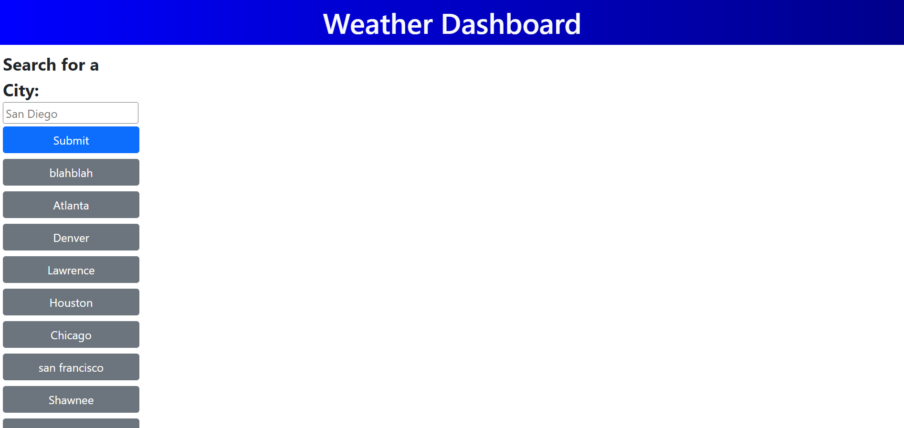

# 06 Server-Side APIs: Weather Dashboard
## User Story

```
AS A traveler
I WANT to see the weather outlook for multiple cities
SO THAT I can plan a trip accordingly
```
## Acceptance Criteria

```
GIVEN a weather dashboard with form inputs
WHEN I search for a city
THEN I am presented with current and future conditions for that city and that city is added to the search history
WHEN I view current weather conditions for that city
THEN I am presented with the city name, the date, an icon representation of weather conditions, the temperature, the humidity, and the wind speed
WHEN I view future weather conditions for that city
THEN I am presented with a 5-day forecast that displays the date, an icon representation of weather conditions, the temperature, the wind speed, and the humidity
WHEN I click on a city in the search history
THEN I am again presented with current and future conditions for that city
```
## Description
The goal of this project is to use a weather api and display the weather information. The information that is displayed is the temperature, wind speed, humidity, and current weather. The application takes in a city that the user inputs and gets the information based on their choice. It displays information of the weather that is currently active at the moment and the weather information in the next 5 days. The information of the next 5 days uses the data for 12pm of each day. The user input will be kept track of and displayed as a history list. Each past search can be clicked on to give the data on that city.

## Usage
The applications can be accessed via https://namhn123.github.io/challenge-6/


